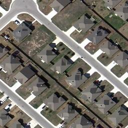
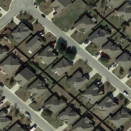
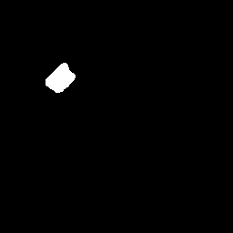
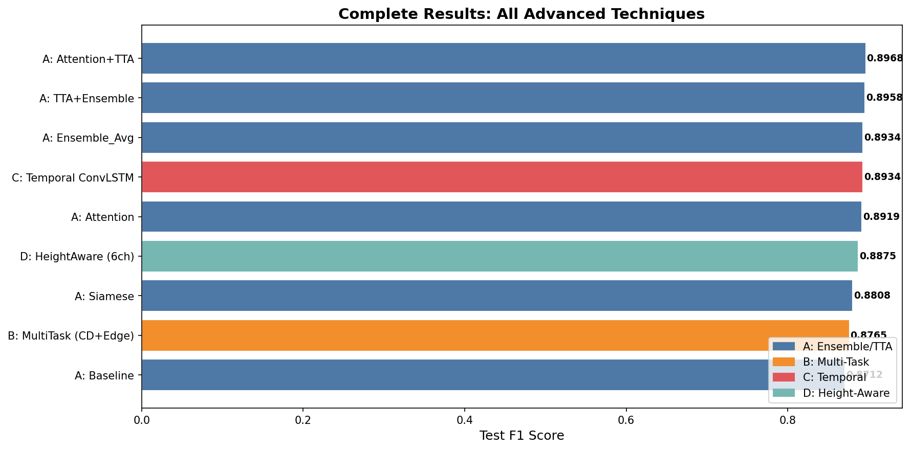
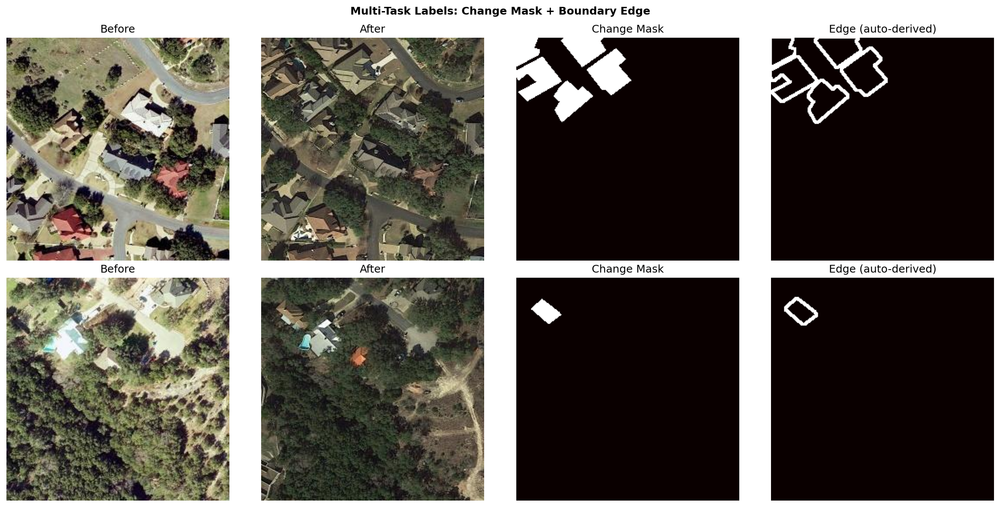
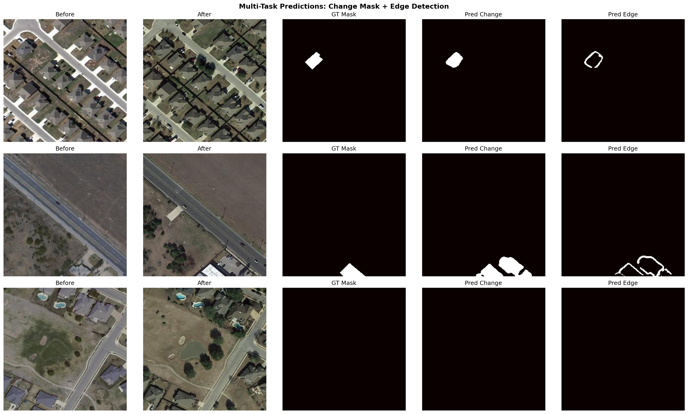
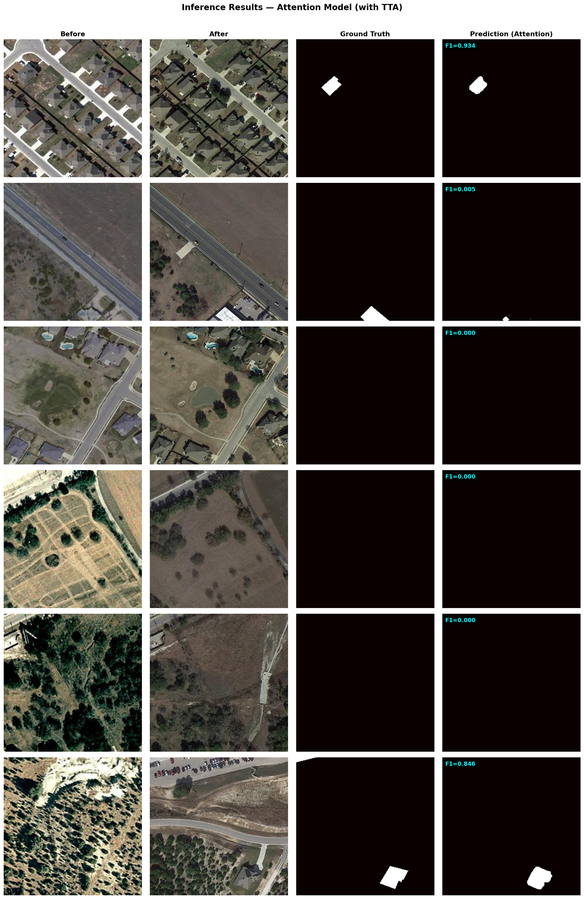

# Building Change Detection in Satellite Imagery Using Deep Learning


A deep learning project for detecting building changes in bi-temporal satellite images using the **LEVIR-CD** dataset. Implements and compares **6 architectures** with advanced techniques including ensemble learning, multi-task boundary detection, temporal ConvLSTM, and height-aware RGB+LiDAR fusion. Achieves **F1 = 0.8968** with Attention + Test-Time Augmentation.

<p align="center">
  
  &nbsp;&nbsp;➜&nbsp;&nbsp;
  
  &nbsp;&nbsp;➜&nbsp;&nbsp;
  
</p>
<p align="center"><b>Before &nbsp;→&nbsp; After &nbsp;→&nbsp; Detected Change Mask</b></p>

---

## Table of Contents

- [Results](#results)
- [Project Structure](#project-structure)
- [Notebooks](#notebooks)
- [Dataset](#dataset)
- [How to Run](#how-to-run)
- [Inference](#inference)
- [Tech Stack](#tech-stack)
- [Key Techniques](#key-techniques)
- [Ongoing Work: 3D Point Cloud Integration](#ongoing-work-3d-point-cloud-integration-for-building-height-estimation)
- [Author](#author)

---

## Results

| Method | F1 Score | IoU | Precision | Recall |
|--------|----------|-----|-----------|--------|
| Baseline U-Net | 0.8712 | 0.7718 | 0.8807 | 0.8619 |
| Siamese U-Net | 0.8808 | 0.7869 | 0.8951 | 0.8669 |
| Attention CD | 0.8919 | 0.8049 | 0.8853 | 0.8986 |
| Ensemble (Avg) | 0.8934 | 0.8073 | 0.9007 | 0.8862 |
| **Attention + TTA** | **0.8968** | **0.8129** | 0.8923 | **0.9013** |
| TTA + Ensemble | 0.8958 | 0.8112 | **0.9045** | 0.8872 |
| Multi-Task (CD+Edge) | 0.8765 | 0.7801 | 0.8886 | 0.8647 |
| Temporal ConvLSTM | 0.8934 | 0.8073 | 0.9053 | 0.8817 |
| Height-Aware (6ch) | 0.8875 | 0.7977 | 0.9036 | 0.8719 |

Best single model: **Attention CD** (F1 = 0.8919) | Best overall: **Attention + TTA** (F1 = 0.8968)

<p align="center">
  
</p>

---

## Project Structure

```
change_detection_project/
├── notebooks/
│   ├── 01_LEVIR_CD_Change_Detection.ipynb    # Baseline U-Net (30 epochs)
│   ├── 02_Advanced_Models_Comparison.ipynb    # 5-model comparison (20 epochs)
│   └── 03_Advanced_Techniques.ipynb          # 4 advanced techniques (15 epochs)
├── figures/                                      # Result visualizations
├── results/
│   ├── advanced_results.json
│   └── advanced_results.csv
└── README.md
```

---

## Notebooks

### Notebook 1: Baseline Change Detection
- U-Net with ResNet34 encoder (6-channel input)
- LEVIR-CD dataset (7,120 train / 1,024 val / 2,048 test images)
- BCEDice loss, AdamW optimizer, CosineAnnealing scheduler
- **F1 = 0.878, IoU = 0.783**

### Notebook 2: Architecture Comparison
Trains 5 architectures under identical settings:
- Baseline U-Net (ResNet34 / ResNet50)
- Siamese U-Net with shared encoder and feature differencing
- Attention CD with cross-attention at bottleneck

### Notebook 3: Advanced Techniques

**Part A -- Ensemble + Test-Time Augmentation**
- Simple averaging and weighted ensemble of 3 models
- TTA with horizontal flip, vertical flip, and 90-degree rotation
- Best combo: Attention + TTA reaches F1 = 0.8968

**Part B -- Multi-Task Learning (Change + Boundary)**
- Dual-head U-Net predicting change mask and edge map simultaneously
- Edge labels derived automatically using morphological operations
- 70/30 weighted loss (change/edge)

<p align="center">
  
</p>
<p align="center"><em>Multi-Task labels — Change Mask + Auto-derived Boundary Edge</em></p>

<p align="center">
  
</p>
<p align="center"><em>Multi-Task predictions — Change Mask + Edge Detection outputs</em></p>

**Part C -- Temporal ConvLSTM**
- Replaces hand-crafted feature differencing with learned temporal comparison
- ConvLSTM cell at the bottleneck of a Siamese encoder
- Extends naturally to N-timestamp inputs for continuous monitoring

**Part D -- Height-Aware 3D Change Detection**
- Accepts both RGB (6ch) and RGB+Height (8ch) inputs
- Height Attention module modulates spatial features using DSM height differences
- Separate height encoder with feature fusion at bottleneck
- Designed for future integration with LiDAR DSM data

---

## Dataset

[LEVIR-CD](https://huggingface.co/datasets/ericyu/LEVIRCD_Cropped256) -- 256x256 cropped patches of building change detection satellite imagery.

| Split | Samples |
|-------|---------|
| Train | 7,120 |
| Val | 1,024 |
| Test | 2,048 |

---

## How to Run

### On Kaggle (recommended, free GPU)
1. Create a new Kaggle notebook
2. Upload any notebook from `notebooks/`
3. Enable GPU: Settings > Accelerator > GPU T4 x2
4. Add your HuggingFace token as a Kaggle secret
5. Click "Run All"

### Local Setup
```bash
pip install torch torchvision segmentation-models-pytorch albumentations huggingface_hub datasets scipy
```

```python
from huggingface_hub import login
login(token="your_hf_token")
```

---

## Inference

Load any trained checkpoint and run predictions on new image pairs:

```python
from PIL import Image

# Load model
model = AttentionCD('resnet34', img_size=256)
model.load_state_dict(torch.load('best_ens_Attention.pth', map_location='cpu'))
model.eval()

# Preprocess and predict
inp = preprocess_pair(Image.open('before.png'), Image.open('after.png'))
prob_map, binary_mask = predict(model, inp, use_tta=True)

# Save result
Image.fromarray(binary_mask).save('change_mask.png')
```

See the inference cell in Notebook 3 for the full pipeline.

<p align="center">
  
</p>
<p align="center"><em>Inference results — Attention model with TTA on test samples</em></p>

---

## Tech Stack

| Category | Tool |
|----------|------|
| Framework | PyTorch |
| Segmentation | segmentation-models-pytorch (smp) |
| Augmentation | Albumentations |
| Dataset | HuggingFace Datasets |
| Training | AdamW, CosineAnnealingLR, BCEDice Loss |
| Metrics | F1, IoU, Precision, Recall |

---

## Key Techniques

| Technique | Purpose |
|-----------|---------|
| Siamese Encoder | Shared weights for fair temporal comparison |
| Cross-Attention | Focus on regions with maximum change |
| Test-Time Augmentation | Free accuracy boost at inference |
| Model Ensemble | Combine diverse architectures |
| Multi-Task Learning | Joint change + boundary prediction |
| ConvLSTM | Learned temporal feature comparison |
| Height Attention | Fuse LiDAR DSM with RGB features |

---

## Ongoing Work: 3D Point Cloud Integration for Building Height Estimation

This project is actively evolving. The current Height-Aware module (Part D) was designed as a stepping stone toward full **3D building change detection** by fusing satellite imagery with airborne LiDAR point clouds.

### Motivation
2D change detection tells us *where* buildings changed, but not *how* — a single-story house demolished and replaced by a 10-story tower appears identical in a binary change mask. Integrating point cloud data lets us answer:
- **What is the height of new/demolished structures?**
- **How did the urban volumetric footprint change over time?**
- **Can we quantify vertical urban growth, not just horizontal?**

### Planned Pipeline

```
Bi-temporal Satellite Images          Bi-temporal LiDAR Point Clouds
        (RGB × 2)                           (XYZ × 2)
            │                                    │
     CNN Encoder (shared)              PointNet++ / KPConv Encoder
            │                                    │
            └──────────┬─────────────────────────┘
                       │
              Cross-Modal Fusion
           (Height Attention + FPN)
                       │
              ┌────────┴────────┐
              │                 │
      2D Change Mask    Height Change Map
      (binary: 0/1)    (continuous: meters)
```

### Key Research Questions
1. **Multi-modal fusion** — How to best align and fuse dense 2D image features with sparse 3D point cloud features at different resolutions?
2. **Point cloud encoding** — PointNet++ vs. KPConv vs. voxelization for efficient height feature extraction from raw LiDAR
3. **Height regression** — Jointly predicting binary change mask + continuous height difference in a multi-task framework
4. **Data scarcity** — Paired satellite + LiDAR temporal datasets are rare; exploring transfer learning and synthetic DSM generation

### Why This Matters
Urban planners and disaster response teams need to know not just *that* a building changed, but *how much* it changed in 3D. This has direct applications in:
- **Urban growth monitoring** — tracking vertical densification in cities
- **Post-disaster damage assessment** — estimating structural loss in 3D
- **Carbon footprint estimation** — building volume correlates with energy consumption
- **Digital twin updates** — keeping city-scale 3D models current

> This direction is inspired by recent advances in multi-modal remote sensing and 3D geospatial AI. I am actively working toward integrating open LiDAR datasets (DALES, ISPRS Vaihingen 3D) to validate this approach.

---

## Author

**Hafiz Mohammad Hussain Zaka**

- [LinkedIn](https://www.linkedin.com/in/hafizhussainz1)
- [GitHub](https://github.com/HafizMHussain)

BE Geo-Informatics Engineering, NUST Pakistan

*I built this project to push beyond standard benchmarks and explore research-grade problems in geospatial AI. If you're working on LiDAR-based change detection, 3D urban modeling, or multi-modal remote sensing — I'd love to connect and collaborate.*

## License

MIT
